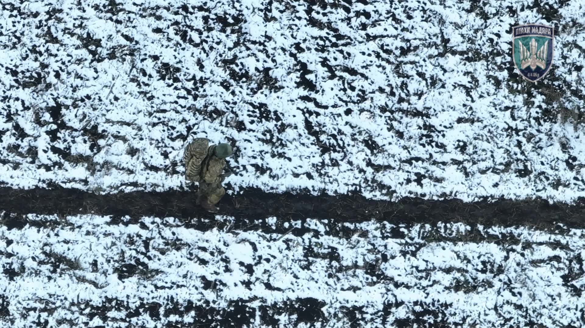
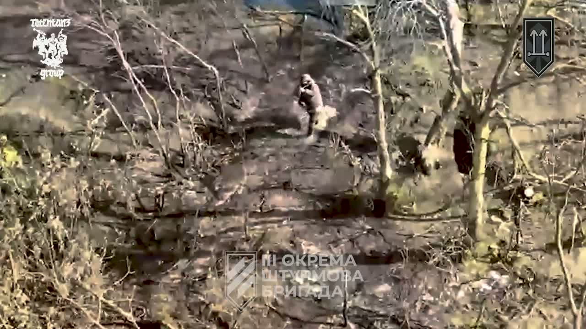
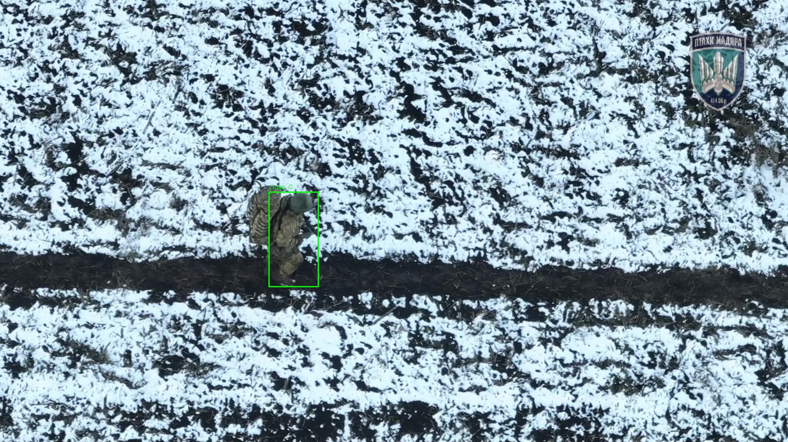

# Drone Object Detection Pipeline

[Українська версія](README_UA.md)

End-to-end computer vision project focused on drone detection: dataset preparation, CVAT annotation workflow, YOLO training, ONNX export, inference scripts, and FastAPI serving.

## Table of Contents

- [Project Overview](#project-overview)
- [What This Project Demonstrates](#what-this-project-demonstrates)
- [Architecture](#architecture)
- [Dataset And Labeling Workflow](#dataset-and-labeling-workflow)
- [Training Pipeline](#training-pipeline)
- [Benchmark Results (Full Test Split, GPU)](#benchmark-results-full-test-split-gpu)
- [Inference](#inference)
- [API](#api)
- [Repository Structure](#repository-structure)
- [Example Results](#example-results)
- [Business Value](#business-value)
- [Challenges Solved](#challenges-solved)
- [What I Learned](#what-i-learned)
- [How To Run](#how-to-run)

## Project Overview

This project is designed as a CV-oriented ML engineering pipeline, not a web product. The core focus is data workflow, model training, reproducible evaluation, and lightweight deployment.

Practical focus: automate object detection in drone imagery to reduce manual review time and speed up monitoring workflows.

## What This Project Demonstrates

- dataset preparation from raw media
- deduplication and data quality checks
- perceptual-hash based duplicate removal before annotation to reduce label noise
- CVAT-to-YOLO annotation conversion with train/val/test split
- YOLO model training and evaluation
- ONNX export for deployment-ready inference
- FastAPI endpoint for image prediction

## Architecture

Ukrainian docs: `docs/architecture_ua.md`, `docs/dataset_ua.md`

```text
Raw videos / images
        ↓
Frame extraction
        ↓
Deduplication
        ↓
Annotation workflow (CVAT)
        ↓
Dataset split
        ↓
YOLO training
        ↓
Model export (ONNX)
        ↓
Image / video inference
        ↓
FastAPI API
```

## Dataset And Labeling Workflow

- Source media is stored in `data/raw/`
- Frames are extracted to `data/interim/`
- Near-duplicates are removed before annotation
- Images are annotated in CVAT
- CVAT export is converted into YOLO format in `data/processed/YOLO/`
- Split coefficients are configured in `configs/train_config.yaml`

Detailed notes: `docs/dataset.md`

## Training Pipeline

- Training config: `configs/train_config.yaml` (`train` section)
- Dataset config: `configs/dataset.yaml`
- Training script: `src/training/train_yolo.py`
- Evaluation script: `src/training/evaluate.py`
- Metrics output: `metrics.json`
- Full training/export/benchmark notebook: `notebooks/model_pipeline_benchmark.ipynb`
  - GPU benchmark table: `.pt`, `.onnx`, `.onnx (fp16)`

## Benchmark Results (Full Test Split, GPU)

Benchmark setup:

- GPU: NVIDIA GeForce GTX 1080
- Frameworks: PyTorch + ONNX Runtime (`CUDAExecutionProvider`)
- Evaluation data: full `test` split from `configs/dataset.yaml`
- Input resolution: `640x640`
- Benchmark batch size: `1` (single-image latency measurement)

| model_format | path | size_mb | precision | recall | map50 | map50_95 | latency_ms | fps | runtime | input_dtype |
| --- | --- | ---: | ---: | ---: | ---: | ---: | ---: | ---: | --- | --- |
| `.onnx` | `models/onnx/model.onnx` | 10.09 | 0.4940 | 0.3491 | 0.3540 | 0.1648 | 9.332 | 107.16 | onnxruntime:CUDAExecutionProvider,CPUExecutionProvider | `numpy.float32` |
| `.pt` | `models/weights/best.pt` | 5.19 | 0.5126 | 0.3467 | 0.3558 | 0.1658 | 12.505 | 79.97 | torch:cuda | `float32` |
| `.onnx (fp16)` | `models/onnx/model.fp16.onnx` | 5.09 | 0.4944 | 0.3529 | 0.3563 | 0.1656 | 12.812 | 78.05 | onnxruntime:CUDAExecutionProvider,CPUExecutionProvider | `numpy.float16` |

Key takeaways:

- `.onnx` (FP32) is the fastest model in this setup: around `1.34x` FPS vs `.pt`.
- Quality drop from `.pt` to `.onnx` is small (`mAP50`: `-0.0018`, `mAP50-95`: `-0.0010`), which is acceptable for many real-time scenarios.
- `.onnx (fp16)` is not faster than `.onnx` FP32 on GTX 1080 (Pascal has no Tensor Cores), so FP16 is not the best option on this hardware.

Recommended deployment choice for edge inference:

- Primary model: `.onnx` FP32 for best latency/FPS to quality balance.
- Fallback/reference model: `.pt` for training-side baseline comparisons.

## Inference

- Image inference: `src/inference/infer_image.py`
- Video inference: `src/inference/infer_video.py`
- Common utilities: `src/inference/utils.py`

Inference parameters (weights, confidence, I/O paths) are in `configs/train_config.yaml`.

## API

FastAPI app: `src/api/main.py`

Endpoints:

- `GET /health`
- `POST /predict` (multipart image file)

Response includes class id, class name, confidence, and bbox coordinates.

## Repository Structure

```text
drone-object-detection-pipeline
│
├ README.md
├ requirements.txt
├ .gitignore
│
├ docs
│   ├ architecture.md
│   ├ architecture_ua.md
│   ├ dataset.md
│   └ dataset_ua.md
│
├ configs
│   ├ dataset.yaml
│   └ train_config.yaml
│
├ data
│   ├ raw
│   ├ interim
│   ├ annotations
│   └ processed
│
├ notebooks
│   ├ dataset_analysis.ipynb
│   └ model_pipeline_benchmark.ipynb
│
├ src
│   ├ data
│   │   ├ extract_frames.py
│   │   ├ deduplicate.py
│   │   └ prepare_dataset.py
│   ├ training
│   │   ├ train_yolo.py
│   │   ├ evaluate.py
│   │   └ export_onnx.py
│   ├ inference
│   │   ├ infer_image.py
│   │   ├ infer_video.py
│   │   └ utils.py
│   └ api
│       ├ main.py
│       └ schemas.py
│
├ models
│   ├ weights
│   └ onnx
│
├ examples
│   ├ input
│   └ output
│
└ assets
    └ architecture.png
```

## Example Results

Visual examples (soldier detection):

| Input | Detection Output |
| --- | --- |
|  |  |
|  |  |

## Business Value

This project is positioned as an ML pipeline that solves practical monitoring tasks:

- reduces manual analysis workload for drone footage
- increases throughput for near real-time detection workflows
- provides reproducible model evaluation for safer model updates
- exposes detection through API, enabling integration into existing systems

For CV/HR review, this demonstrates full pipeline ownership: data preparation, annotation workflow, model training, export to deployment format, inference benchmarking, and API serving.

## Challenges Solved

- converting CVAT export into consistent YOLO train/val/test structure
- keeping split reproducible using configurable coefficients and seed
- separating training, inference, and API concerns into clear modules
- exposing the same model logic via scripts and API

## What I Learned

- data quality (dedup + annotation consistency) has direct impact on detector quality
- structured configs simplify reproducible ML experimentation
- deployment-friendly artifacts (ONNX + API) improve project completeness for CV
- small, clear pipelines are easier to defend in interviews than over-engineered stacks

## How To Run

### System Requirements

- Install Python dependencies:

```bash
pip install -r requirements.txt
```

- Install `ffmpeg` and ensure it is available in `PATH` (`ffmpeg -version` should work).
- For large-scale annotation, run a local CVAT container (Docker) and use it as the labeling workspace.

### Data Preparation

1. Put source videos into `data/raw/`.
2. Extract frames and remove near-duplicates:

```bash
python src/data/extract_frames.py
python src/data/deduplicate.py
```

3. Create a CVAT task and annotate the prepared frames.
4. Export annotations in YOLO format. If direct YOLO export is unavailable in your CVAT setup, normalize the exported data with:

```bash
python src/data/prepare_dataset.py
```

5. Run dataset analysis:

```bash
jupyter notebook notebooks/dataset_analysis.ipynb
```

### Model Building

1. Configure parameters in `configs/train_config.yaml` and `configs/dataset.yaml`.
2. Train the `.pt` model:

```bash
python src/training/train_yolo.py
```

3. Evaluate on `test` split:

```bash
python src/training/evaluate.py
```

4. Export to `.onnx`:

```bash
python src/training/export_onnx.py
```

### Benchmark

Use the notebook to compare `.pt`, `.onnx`, and `.onnx (fp16)`:

```bash
jupyter notebook notebooks/model_pipeline_benchmark.ipynb
```

### Additional

- Batch inference for images/videos:

```bash
python src/inference/infer_image.py
python src/inference/infer_video.py
```

- Run FastAPI backend:

```bash
python -m uvicorn src.api.main:app --reload
```


